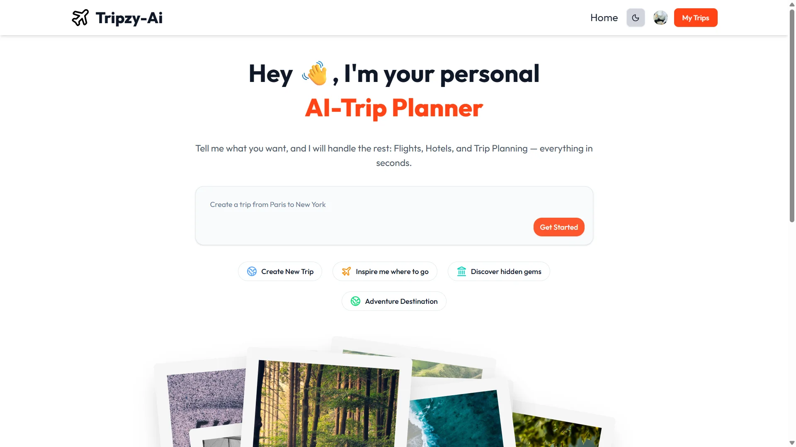

# 👨‍💻 Ashvary Gidian | Full Stack Developer Portfolio

<p align="center">
  
</p>

<p align="center">
  <a href="https://ashvarygidian.vercel.app">
    
  </a>
  <a href="https://github.com/Ashvary11">
    
  </a>
  <a href="https://www.linkedin.com/in/ashvary-gidian">
    
  </a>
  <a href="mailto:ashvary11@gmail.com">
    
  </a>
</p>

---

## 🖼️ About Me

<p align="center">
  
</p>

I specialize in the **MERN stack** (MongoDB, Express, React, Node.js) and have experience with Next.js, TypeScript, and various modern frameworks.

I build modern and responsive web applications using clean, maintainable code. Skilled in developing end-to-end projects, I work on both frontend and backend development — designing intuitive user interfaces, building REST APIs, and managing databases to ensure smooth integration and reliable functionality.

I focus on writing structured and efficient code, improving application performance, and creating seamless digital experiences that prioritize usability and clarity.

---

## 🛠️ Tech Stack

<p align="center">
  
</p>

### Frontend


### Backend


### Tools & Platforms


---

## 📂 Project Structure

```text
portfolio_v2.0/
├── app/                          # Next.js 16 App Router
│   ├── (sections)/               # Portfolio sections
│   │   ├── hero/                 # Hero/Introduction section
│   │   ├── skills/               # Skills showcase with animations
│   │   ├── experience/           # Work experience
│   │   ├── projects/             # Projects showcase
│   │   ├── contact/              # Contact form
│   │   └── resume/               # Resume section
│   ├── layout.tsx                # Root layout
│   ├── page.tsx                  # Home page
│   └── globals.css               # Global styles
├── components/                   # Reusable components
│   ├── layout/                   # Layout components (Navbar, Footer)
│   └── ui/                       # UI components (shadcn/ui)
├── data/                         # Project data
│   └── projectData.ts            # Projects information
├── lib/                          # Utility functions
├── public/                      # Static assets
│   ├── project-images/           # Project screenshots
│   └── resume/                   # Resume PDF
├── package.json                  # Dependencies
├── next.config.ts                # Next.js configuration
├── tailwind.config.ts            # Tailwind configuration
└── tsconfig.json                 # TypeScript configuration
```

---

## 🚀 Featured Projects

### 1. Tripzy-AI 🤖✈️
> AI-Powered Trip Planner with 3D Globe & Chatbot

<p align="center">
  
</p>

An intelligent travel planning application powered by **Google Gemini** and **LangChain** that generates personalized trip itineraries through natural conversation. Features include:

- 🤖 AI-powered trip planning via conversational chatbot
- 🌍 Interactive 3D globe visualization
- 🏨 Personalized hotel recommendations
- 📅 Day-by-day itinerary generation
- 🗺️ Google Maps integration
- 🔐 Clerk authentication
- 💾 MongoDB for trip storage

**Tech Stack:** Next.js • React • TypeScript • Tailwind • Shadcn UI • Aceternity UI • MongoDB • Clerk • Gemini • LangChain • Arcjet • Vercel

[](https://tripzy-ai.vercel.app/)
[](https://github.com/Ashvary1996/TripzyAi)

---

### 2. E-Commerce App 🛒
> Full-stack e-commerce platform with admin dashboard

A comprehensive e-commerce solution featuring user authentication, product management, shopping cart, and secure payments. Includes a multi-feature admin dashboard.

- 👤 User authentication (JWT)
- 🔍 Product search & filtering
- 🛒 Shopping cart
- 💳 Razorpay payment integration
- 📦 Multi-step checkout
- 👨‍💼 Admin dashboard
- 🔑 Password reset functionality

**Tech Stack:** React • Tailwind • Redux Toolkit • Node.js • Express • MongoDB • JWT • Razorpay • NodeMailer

[](https://ecom-app-by-ashvary.netlify.app/)
[](https://github.com/Ashvary1996/e-com-app)

---

### 3. Red Bus 🚌
> Bus ticket booking web application

A full-stack bus ticket booking application with seat selection and Stripe payment integration.

- 🔍 Bus search functionality
- 💺 Interactive seat selection
- 💳 Secure Stripe payment
- 🎫 Ticket generation

**Tech Stack:** React • Tailwind • Redux • Node.js • Express • MongoDB • Stripe

[](https://red-bus-by-ashvary.netlify.app/)
[](https://github.com/Ashvary1996/RedBus)

---

### 4. Flashcard Generator 📚
> Interactive flashcard creation app

A React-based application for creating, managing, and printing flashcards with local storage support.

- ➕ Create text and image flashcards
- 📄 Download as PDF
- 🖨️ Print support
- ✅ Form validation (Formik & Yup)
- 💾 Local storage persistence

**Tech Stack:** React • Tailwind • Redux Toolkit • Formik • Yup • jsPDF

[](https://flashcardgenerator4.netlify.app/)
[](https://github.com/Ashvary1996/flashcardgenerator)

---

## 💼 Work Experience

### 🖥️ Backend Developer | Viacerta Abroad
**March 2025 - June 2025**

- Designed robust backend architecture for Viacerta Abroad
- Built RESTful APIs for blogs, courses, and support
- Implemented Redis caching for performance optimization
- Automated email communication workflows
- Developed real-time communication with SSE and chatbot integrations
- Created lead tracking system with Excel export capabilities
- Implemented JWT authentication and rate limiting

**Tech Stack:** HTML5 • CSS3 • JavaScript • React • Node.js • Express • MongoDB • Redis • JWT • Bcrypt • Google APIs • SSE • Git

---

### 🖥️ Intern - Software Developer | SellerPundit
**September 2024 - October 2024**

- Refactored MVC structure for improved scalability
- Integrated Nodemailer for email automation
- Implemented Excel import/export utilities
- Streamlined codebase and fixed bugs

**Tech Stack:** HTML • CSS • JavaScript • React • Node.js • Express • Git • Postman

---

## 📊 GitHub Stats

<p align="center">
  
  
</p>

<p align="center">
  
</p>

---

## 📬 Contact Me

<p align="center">
  <a href="mailto:ashvary11@gmail.com">
    
  </a>
  <a href="https://www.linkedin.com/in/ashvary-gidian">
    
  </a>
  <a href="https://github.com/Ashvary11">
    
  </a>
</p>

---

## 📝 Resume

<p align="center">
  <a href="./public/resume/ashvary-gidian-resume.pdf">
    
  </a>
</p>

---

<p align="center">
  
</p>

<p align="center">
  <sub>⭐️ From <a href="https://github.com/Ashvary11">Ashvary Gidian</a> with ❤️</sub>
</p>

